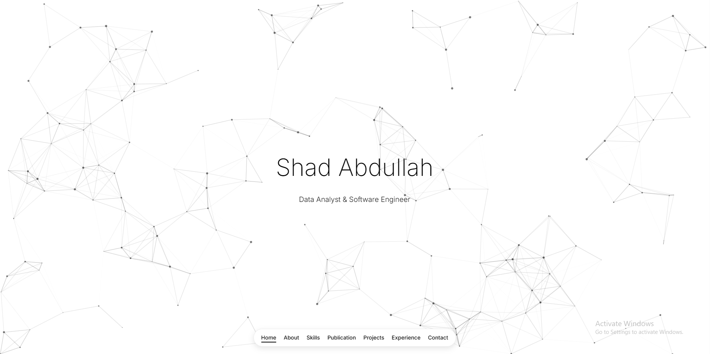

## Live Demo

Check out the live version of my portfolio here: [Shad Abdullah Portfolio](https://excavitor.github.io/Portfolio/)

# Personal Portfolio Website

## Overview

This is a modern, responsive personal portfolio website designed to showcase professional accomplishments, skills, and contact information. The website features a clean, minimalist design with smooth animations and interactive elements.

## Features

- **Responsive Design**: Fully responsive layout that works on all devices from mobile to desktop
- **Particle.js Background**: Interactive particle animation in the hero section
- **Smooth Scroll**: Enhanced user experience with smooth scrolling between sections
- **Form Validation**: Contact form with validation and submission feedback
- **Modal Feedback**: Interactive modal for contact form submission status
- **Animated Elements**: Subtle animations for improved user engagement
- **Accessibility**: Designed with accessibility in mind

## Sections

1. **Home**: Introduction with animated name reveal
2. **About**: Personal information and background
3. **Skills**: Technical and professional skills
4. **Publications**: Featured publications with images
5. **Projects**: Showcase of key projects
6. **Experience**: Professional experience and history
7. **Contact**: Contact form and direct contact information

## Technologies Used

- HTML5
- CSS3 (with custom variables and animations)
- JavaScript (vanilla)
- Particles.js for background animation
- FontAwesome for icons
- FormSubmit for form handling

## Browser Compatibility

Tested and working on:
- Chrome
- Edge

## Credits

- Particles.js for the interactive background
- Font Awesome for the icons
- FormSubmit for handling form submissions
